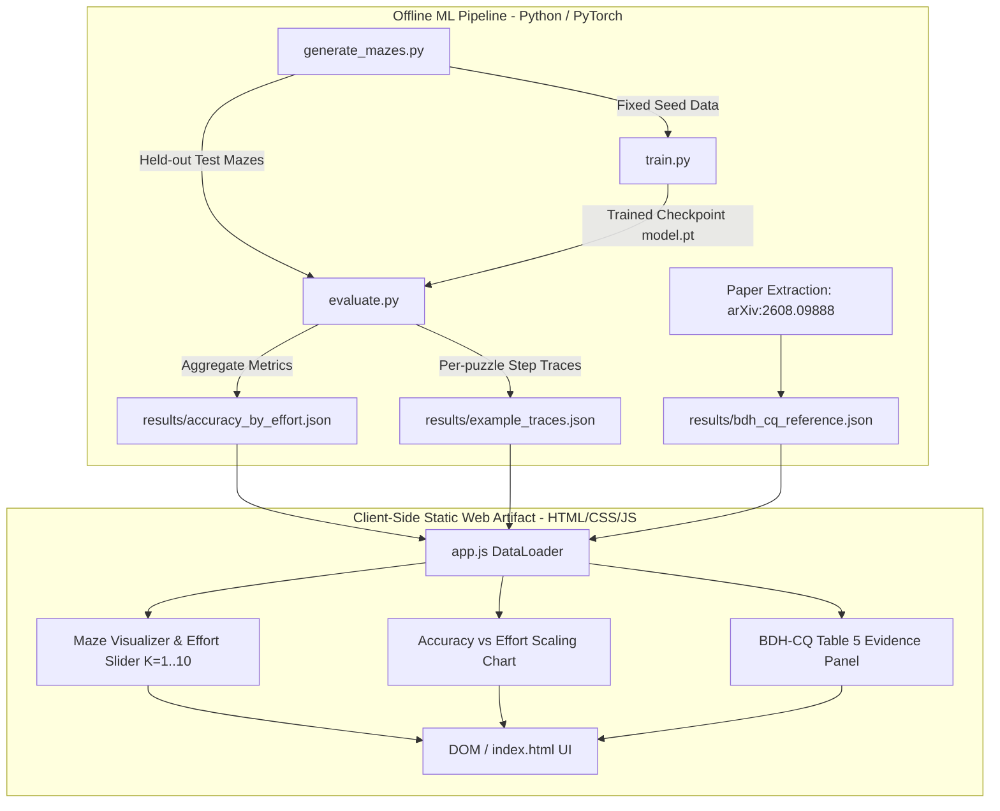
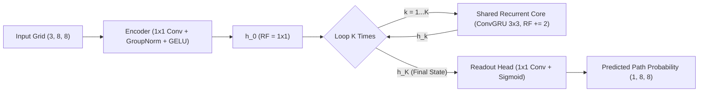

# System Design: Inference-Time Scaling Explainer

**Project**: Inference-Time Scaling Explainer  
**Context**: Pathway x DataForge Hackathon  
**Status**: Approved Architecture  

---

## 1. Architecture Overview

The system consists of two decoupled subsystems:
1. **Offline ML Pipeline (`ml/`)**: Generates deterministic synthetic mazes, trains a compact recurrent latent-reasoning neural network using a variable-loop curriculum, and evaluates performance across $K \in [1, 10]$ recurrent steps to output static JSON records.
2. **Client-Side Web Artifact (`site/`)**: A zero-dependency static web application (HTML5/CSS3/Vanilla JS) that ingests the precomputed JSON records and renders an interactive, accessible explainer.



---

## 2. ML Pipeline Design (`ml/`)

### 2.1 Synthetic Maze Generator (`ml/generate_mazes.py`)
- **Grid Configuration**: $8 \times 8$ grid ($N=8$).
- **Algorithm**: Depth-First Search with randomized backtracking (or randomized Kruskal's) seeded deterministically.
  - Walls are represented as 1s, traversable passages as 0s.
  - Start node: Top-Left $(0, 0)$.
  - Goal node: Bottom-Right $(N-1, N-1)$.
  - Guarantees solvability: Uses Breadth-First Search (BFS) to compute the unique/shortest optimal path mask.
- **Data Tensors**:
  - Input: 3-channel binary grid of shape $(3, N, N)$:
    - Channel 0: Wall layout ($1 = \text{wall}, 0 = \text{free}$).
    - Channel 1: Start position one-hot mask.
    - Channel 2: Goal position one-hot mask.
  - Target: 1-channel binary path mask of shape $(1, N, N)$ indicating whether cell $(r, c)$ belongs to the ground-truth shortest path.

### 2.2 Recurrent Latent-Reasoning Model (`ml/model.py`)
Standard feed-forward networks perform a fixed number of operations per layer. In contrast, this model separates **input encoding**, **recurrent latent computation**, and **output decoding**:
- **Input Projection**: Pointwise $1 \times 1$ convolution mapping $3 \text{ channels} \rightarrow D \text{ latent channels}$ (via Conv2D($1\times 1$) + GroupNorm + GELU). Receptive field is strictly $1 \times 1$, ensuring no neighbor propagation occurs prior to recurrent loops.
- **Recurrent Core (`ConvGRURecurrentCore`)**:
  - Gated recurrent unit where candidate state and gates use $3 \times 3$ convolutions on recurrent state $h_{k-1}$ and $1 \times 1$ convolutions on input context $h_{\text{init}}$:
    $$h_k = \text{ConvGRU}(h_{k-1}, h_{\text{init}})$$
  - Each recurrent loop expands the effective spatial receptive field by $2$ grid cells ($\text{RF}(K) = 1 + 2K$).
  - Shared weights are applied $K$ times sequentially.
  - No natural-language tokens or external outputs are generated between steps. Reasoning occurs purely as continuous tensor refinement in the latent space $\mathbb{R}^{D \times N \times N}$.
- **Readout Head**: Pointwise $1 \times 1$ convolution ($D \rightarrow 1$) projecting final latent state $h_K$ to per-cell logits followed by sigmoid.



### 2.3 Training Curriculum (`ml/train.py`)
- If a recurrent model is trained only at a fixed $K$, it overfits to that specific depth.
- **Variable-Loop Exposure**: During each forward training step, loop count $K$ is uniformly sampled from $\{1, 2, \dots, K_{\max}\}$ ($K_{\max} = 10$).
- **Objective Function**: Weighted Binary Cross-Entropy (BCE) combined with Dice/IoU loss on the path mask:
  $$\mathcal{L} = \text{BCE}(p_K, y) + \alpha \cdot \mathcal{L}_{\text{Dice}}(p_K, y)$$
- **Optimizer**: AdamW ($\text{lr} = 10^{-3}$, weight decay $10^{-4}$) with cosine annealing schedule.

### 2.4 Evaluator & Data Exporter (`ml/evaluate.py`)
Evaluates the trained checkpoint on 100 held-out test mazes for each $K \in \{1, 2, \dots, 10\}$.
Calculates:
1. **Cell-level Accuracy & Path IoU**: Intersection over Union between predicted binary mask ($\text{prob} > 0.5$) and ground truth.
2. **Exact Solve Rate**: Fraction of test mazes where the predicted path forms a complete, unbroken, valid sequence of adjacent cells connecting start to goal without cutting through walls.
3. **Trace Extraction**: Extracts full $K=1 \dots 10$ prediction grids for 4 diverse demonstration mazes (e.g., Easy/Short path, Medium path, Complex winding path).

---

## 3. Data Contract Specifications

### 3.1 `results/accuracy_by_effort.json`
```json
{
  "metadata": {
    "model_name": "RecurrentLatentSolver-8x8",
    "param_count": 94250,
    "test_set_size": 100,
    "grid_size": [8, 8],
    "random_seed": 42,
    "provenance": "PRECOMPUTED_REAL"
  },
  "scaling_curve": [
    {
      "step": 1,
      "exact_solve_rate": 0.12,
      "path_iou": 0.412,
      "mean_bce_loss": 0.485
    },
    {
      "step": 10,
      "exact_solve_rate": 0.88,
      "path_iou": 0.895,
      "mean_bce_loss": 0.082
    }
  ]
}
```

### 3.2 `results/example_traces.json`
```json
{
  "provenance": "PRECOMPUTED_REAL",
  "puzzles": [
    {
      "puzzle_id": "maze_01",
      "difficulty": "Medium",
      "walls": [[0, 1, 0, ...], ...],
      "start": [0, 0],
      "goal": [7, 7],
      "ground_truth_path": [[0, 0], [0, 1], ...],
      "ground_truth_mask": [[1, 1, 0, ...], ...],
      "steps": {
        "1": {
          "probabilities": [[0.85, 0.42, ...], ...],
          "predicted_path": [[0, 0], [0, 1], ...],
          "is_solved": false,
          "iou": 0.38
        },
        "10": {
          "probabilities": [[0.99, 0.98, ...], ...],
          "predicted_path": [[0, 0], [0, 1], ...],
          "is_solved": true,
          "iou": 0.94
        }
      }
    }
  ]
}
```

### 3.3 `results/bdh_cq_reference.json`
```json
{
  "provenance": "EXTERNAL_REPORTED",
  "source_paper": {
    "title": "BDH-CQ: In-Context Learning with Recurrent Latent Reasoning",
    "authors": "Kosowski et al.",
    "arxiv_id": "arXiv:2608.09888",
    "table": "Table 5",
    "caption": "Comparing pass@2 and cost across reasoning efforts LOW, MEDIUM, HIGH"
  },
  "benchmark": "ARC-AGI-1 Public Evaluation Set",
  "metric": "pass@2",
  "effort_levels": [
    {
      "level": "LOW",
      "pass_at_2": 21.0,
      "cost_reduction_pct": 22.0,
      "relative_cost": 0.78
    },
    {
      "level": "MEDIUM",
      "pass_at_2": 27.0,
      "cost_reduction_pct": 11.0,
      "relative_cost": 0.89
    },
    {
      "level": "HIGH",
      "pass_at_2": 29.5,
      "cost_reduction_pct": 0.0,
      "relative_cost": 1.00
    }
  ],
  "disclaimer": "These numbers are reported by Pathway in arXiv:2608.09888 and evaluated on ARC-AGI-1. They are not independently reproduced by this toy maze experiment."
}
```

---

## 4. Client-Side Web Architecture (`site/`)

### 4.1 Page Layout & Component Breakdown
1. **Header & Claim Banner**:
   - Title: *Inference-Time Scaling Explainer*
   - Central Claim callout card with distinction between token CoT vs. latent recurrence.
   - Status badge: `[PRECOMPUTED REAL DATASET + EXTERNAL BENCHMARK EVIDENCE]`.
2. **Interactive Reasoning Effort Explorer (FR1 & FR2)**:
   - Puzzle selector tabs (Puzzle 1, 2, 3, 4).
   - Effort Slider: Range $1 \dots 10$ with step markers and keyboard ARIA attributes.
   - Side-by-side grid panels:
     - Left: Model Prediction at step $K$ (cell heatmaps + thresholded path).
     - Right: Ground Truth Solution Path.
   - Live metrics summary: IoU, continuous path validity badge (Solved / Incomplete).
   - Update Latency: Sub-200ms response time per user interaction.
3. **Aggregate Scaling Curve Module (FR3)**:
   - Accessible SVG line chart plotting Exact Solve Rate and IoU vs. Steps $1 \dots 10$.
   - Interactive hover points showing exact values.
   - Hidden semantic `<table>` for screen readers (WCAG AA).
4. **BDH-CQ Evidence Module (FR4)**:
   - Bar / Line dual comparison chart of Table 5 numbers: Accuracy ($21.0\% \rightarrow 27.0\% \rightarrow 29.5\%$) vs. Compute Cost ($78\% \rightarrow 89\% \rightarrow 100\%$).
   - Explicit disclaimer card highlighting that this is published external frontier data.
5. **Honest Provenance & Academic Context (FR5 & FR6)**:
   - Three-column breakdown: What is Live vs. Precomputed vs. Illustrative.
   - Full citations to both papers with direct links:
     - *The Dragon Hatchling: The Missing Link Between the Transformer and Models of the Brain* (arXiv:2509.26507)
     - *BDH-CQ: In-Context Learning with Recurrent Latent Reasoning* (arXiv:2608.09888)
   - Reproducibility command guide.
